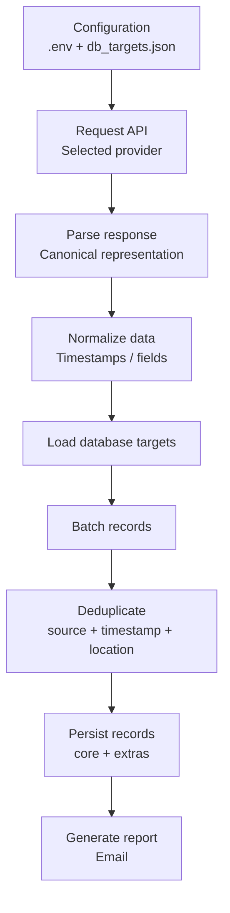

# Extensible Data Pipeline

An extensible data ingestion pipeline for collecting data from multiple external APIs, normalizing it into a canonical representation, deduplicating records, and persisting them across different database systems.

The project was initially developed for **meteorological data**, but its architecture was designed so that new data providers, database targets, and fields can be added without changing the core pipeline logic.

## Key Features

* Multiple external **REST API providers**
* Canonical data representation independent of the source API
* Timestamp normalization
* Record deduplication before insertion
* Multiple database backends
* Configurable providers and targets through environment/configuration files
* Optional additional fields without modifying the core schema
* Execution summary reports via email
* Extensible provider and storage architecture

## Architecture



The pipeline separates the **data source** from the **storage target**.

A provider is responsible for converting its API response into the common canonical format, while database targets consume that same representation independently.

This means that adding a new API does not require changing the persistence layer, and adding a new database does not require changing individual providers.

## Supported Providers

The current implementation includes support for meteorological data from:

* **Weatherbit**
* **IPMA**
* **ICAO / METAR**

Each provider converts its own response format into the same internal representation.

Example:

```python
{
    "fonte": "...",
    "data": datetime(...),
    "temp": 20.5,
    "humidade": 75,
    "vento": 4.2,
    "pressao": 1015,
    "precipitacao": 0.0,
    "lugar": "...",
    "lat": 41.15,
    "lon": -8.61,
    "extras": {}
}
```

Provider-specific data that does not belong to the common schema can be stored inside `extras`.

## Supported Database Targets

The pipeline currently supports:

* PostgreSQL-compatible databases
* MySQL / MariaDB
* CrateDB
* MongoDB

Targets are configured independently through `db_targets.json`.

Example:

```json
{
  "targets": [
    {
      "name": "postgres",
      "type": "postgres",
      "dsn_env": "POSTGRES_DSN",
      "table": "meteo",
      "extras_column": "extras"
    },
    {
      "name": "mongodb",
      "type": "mongodb",
      "uri_env": "MONGO_URI",
      "database": "meteo",
      "collection": "meteo"
    }
  ]
}
```

Database credentials are referenced through environment variables rather than stored in the configuration file.

## Deduplication

The pipeline is designed to be safely re-executed without continuously inserting the same observations.

Records are identified using:

```text
(source, timestamp, location)
```

For every target, the pipeline:

1. groups incoming observations;
2. checks which locations already exist for the corresponding source and timestamp;
3. inserts only records that are not already present.

For additional protection against concurrent writes, SQL targets can define a unique constraint:

```sql
UNIQUE (fonte, data, lugar)
```

MongoDB can use an equivalent unique compound index:

```javascript
db.meteo.createIndex(
    { fonte: 1, data: 1, lugar: 1 },
    { unique: true }
)
```

## Extensibility

A major goal of the project was to avoid coupling the pipeline to a single API or database technology.

### Adding a New Data Provider

A provider only needs to:

1. request or receive data from the new source;
2. parse the provider-specific format;
3. return records using the canonical representation.

For example:

```python
rows.append({
    "fonte": source,
    "data": timestamp,
    "lugar": location,
    # canonical fields...
    "extras": {}
})
```

The deduplication and persistence layers can then process those records without knowing which API produced them.

### Adding a New Database Target

A new storage target implements the expected database operations while keeping the rest of the pipeline unchanged.

Configuration determines which targets are active:

```text
API Provider
     │
     ▼
Canonical Records
     │
     ├── PostgreSQL
     ├── MySQL
     ├── CrateDB
     └── MongoDB
```

### Adding New Fields

Fields common to every provider can become part of the canonical representation.

Provider-specific fields are instead stored inside:

```python
extras
```

This avoids changing every database schema whenever one provider exposes additional information.

## Configuration

Configuration is handled using environment variables and `db_targets.json`.

Example `.env`:

```env
PIPELINE_NAME=GM-METEO
PIPELINE_ENV=local

PIPELINE_API_PROVIDER=icao

ICAO_CODE=LPPR

PIPELINE_DB_TARGETS_FILE=db_targets.json

PIPELINE_SQL_EXTRAS_COLUMN=extras
```

Sensitive values such as API keys and database credentials should remain in the local `.env` file.

An `.env.example` can be committed with placeholder values.

## Installation

Requires **Python 3.10+**.

Install dependencies with:

```bash
pip install -r requirements.txt
```

Main dependencies include:

* `requests`
* `python-dotenv`
* `psycopg2-binary`
* `pymysql`
* `mysql-connector-python`
* `pymongo`
* `tabulate`

The exact database dependencies required depend on the configured targets.

## Running

```bash
python main.py
```

The selected provider and database targets are loaded from the project configuration.

## Project Goals

This project explores several software engineering problems beyond simply retrieving weather data:

* isolating external API formats from application logic;
* designing a common representation for heterogeneous sources;
* supporting multiple storage technologies;
* preventing duplicate ingestion;
* managing configuration and credentials;
* designing systems that can be extended without rewriting existing components.

The meteorological use case acts as the current implementation, while the pipeline architecture allows other structured data sources to be integrated using the same approach.
